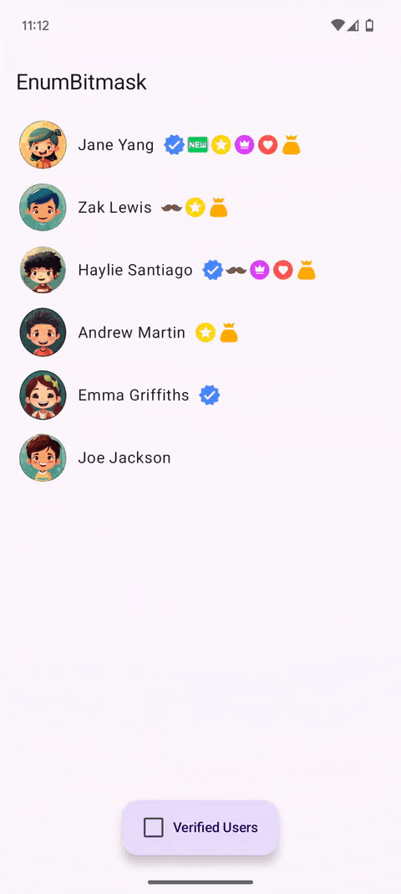

EnumBitmask
=

[![](https://img.shields.io/badge/Пост_в_Telegram-24A1DE?&style=for-the-badge&logo=data:image/svg+xml;base64,PHN2ZyB3aWR0aD0iNDciIGhlaWdodD0iMzkiIHZpZXdCb3g9IjAgMCA0NyAzOSIgZmlsbD0ibm9uZSIgeG1sbnM9Imh0dHA6Ly93d3cudzMub3JnLzIwMDAvc3ZnIj4KPHBhdGggZmlsbC1ydWxlPSJldmVub2RkIiBjbGlwLXJ1bGU9ImV2ZW5vZGQiIGQ9Ik0zLjE3MjkyIDE2LjQ2NjRDMTUuNTYyNSAxMS4wNjg0IDIzLjgyNDIgNy41MDk3NSAyNy45NTggNS43OTAzOEMzOS43NjA3IDAuODgxMjMxIDQyLjIxMzIgMC4wMjg0NTkzIDQzLjgxMTcgMC4wMDAzMDAyMzhDNDQuMTYzMiAtMC4wMDU4OTMwMyA0NC45NDkzIDAuMDgxMjM3OSA0NS40NTg1IDAuNDk0NDJDNDUuODg4NSAwLjg0MzMwMyA0Ni4wMDY4IDEuMzE0NTkgNDYuMDYzNCAxLjY0NTM3QzQ2LjEyIDEuOTc2MTUgNDYuMTkwNSAyLjcyOTY4IDQ2LjEzNDUgMy4zMTg0NkM0NS40OTQ5IDEwLjAzODcgNDIuNzI3NCAyNi4zNDcgNDEuMzE5NCAzMy44NzM4QzQwLjcyMzcgMzcuMDU4NyAzOS41NTA2IDM4LjEyNjUgMzguNDE1IDM4LjIzMUMzNS45NDY5IDM4LjQ1ODIgMzQuMDcyOCAzNi42IDMxLjY4MjMgMzUuMDMzQzI3Ljk0MTggMzIuNTgxIDI1LjgyODYgMzEuMDU0NyAyMi4xOTc4IDI4LjY2MkMxOC4wMDE3IDI1Ljg5NjggMjAuNzIxOCAyNC4zNzcxIDIzLjExMzIgMjEuODkzM0MyMy43MzkgMjEuMjQzMyAzNC42MTMzIDExLjM1MjMgMzQuODIzOCAxMC40NTVDMzQuODUwMSAxMC4zNDI4IDM0Ljg3NDUgOS45MjQ1MSAzNC42MjYgOS43MDM2NEMzNC4zNzc1IDkuNDgyNzYgMzQuMDEwNyA5LjU1ODI5IDMzLjc0NjEgOS42MTgzNkMzMy4zNzA5IDkuNzAzNTEgMjcuMzk1MyAxMy42NTMxIDE1LjgxOTMgMjEuNDY3M0MxNC4xMjMyIDIyLjYzMiAxMi41ODY4IDIzLjE5OTUgMTEuMjEwNCAyMy4xNjk3QzkuNjkyODkgMjMuMTM2OSA2Ljc3Mzg4IDIyLjMxMTcgNC42MDM5MSAyMS42MDY0QzEuOTQyMzQgMjAuNzQxMiAtMC4xNzMwMTkgMjAuMjgzOCAwLjAxMTE4MTUgMTguODE0NEMwLjEwNzEyNCAxOC4wNDkxIDEuMTYxMDQgMTcuMjY2NCAzLjE3MjkyIDE2LjQ2NjRaIiBmaWxsPSJ3aGl0ZSIvPgo8L3N2Zz4K)](https://t.me/foundout/45)

EnumBitmask is an application that demonstrates how to work with bitmasks in a type-safe and intuitive way using Kotlin enums. The app provides examples of common bitmask operations, making it easier to understand and apply this approach in real projects.
This project uses images from the [Figma Community File](https://www.figma.com/community/file/1278238556561592696).

    

